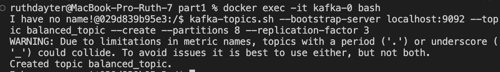
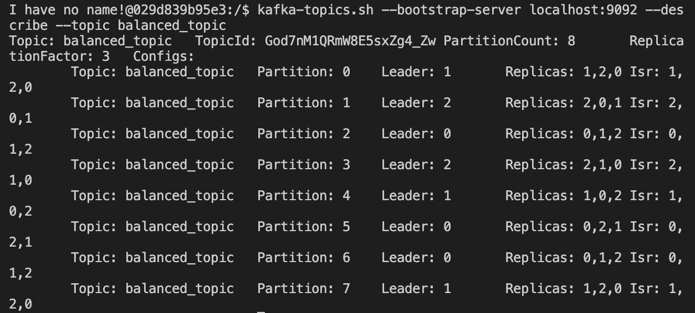
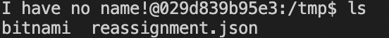
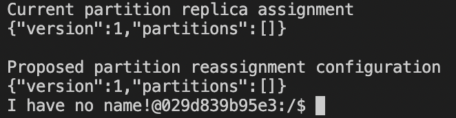
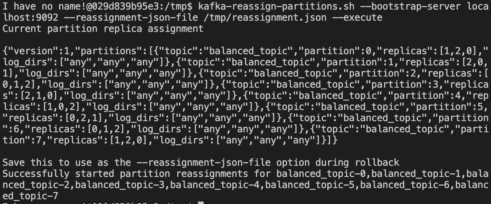

# зайти в терминал контейнера kafka-0
команда:
`docker exec -it kafka-0 bash`

# создание топика balanced_topic
команда:
`kafka-topics.sh --bootstrap-server localhost:9092 --topic balanced_topic --create --partitions 8 --replication-factor 3`

вывод:

[](https://github.com/dayterr/kafka-project-4/blob/main/part1/pics/step1.png)

<!---
можно посмотреть картинку step1.png в директории pics
-->

# проверим состояние партиций
команда:
`kafka-topics.sh --bootstrap-server localhost:9092 --describe --topic balanced_topic`

вывод:

[](https://github.com/dayterr/kafka-project-4/blob/main/part1/pics/step2.png)

<!---
можно посмотреть картинку step2.png в директории pics
-->

# создаим файл reassignment.json
команда:
```
cd /tmp && echo '{
    "version": 1,
    "partitions": [
      {"topic": "balanced_topic", "partition": 0, "replicas": [0, 1], "log_dirs": ["any", "any"]},
      {"topic": "balanced_topic", "partition": 1, "replicas": [1, 2], "log_dirs": ["any", "any"]},
      {"topic": "balanced_topic", "partition": 2, "replicas": [2, 0], "log_dirs": ["any", "any"]},
      {"topic": "balanced_topic", "partition": 3, "replicas": [1, 2], "log_dirs": ["any", "any"]},
      {"topic": "balanced_topic", "partition": 4, "replicas": [2, 0], "log_dirs": ["any", "any"]},
      {"topic": "balanced_topic", "partition": 5, "replicas": [0, 1], "log_dirs": ["any", "any"]},
      {"topic": "balanced_topic", "partition": 6, "replicas": [0, 1], "log_dirs": ["any", "any"]},
      {"topic": "balanced_topic", "partition": 7, "replicas": [1, 2], "log_dirs": ["any", "any"]}
    ]
  }' > reassignment.json
```

проверим, что файл создан:
`ls`

вывод:

[](https://github.com/dayterr/kafka-project-4/blob/main/part1/pics/step3.png)

<!---
можно посмотреть картинку step2.png в директории pics
файл reassignment.json также лежит в репозитории
-->

# перераспределим партиции 
команда:
```
kafka-reassign-partitions.sh \
--bootstrap-server localhost:9092 \
--broker-list "1,2,3" \
--topics-to-move-json-file "/tmp/reassignment.json" \
--generate
```

вывод:

[](https://github.com/dayterr/kafka-project-4/blob/main/part1/pics/step4-1.png)

<!---
можно посмотреть картинку step4-1.png в директории pics
-->

команда:
```
kafka-reassign-partitions.sh --bootstrap-server localhost:9092 --reassignment-json-file /tmp/reassignment.json --execute
```

[](https://github.com/dayterr/kafka-project-4/blob/main/part1/pics/step4-2.png)

<!---
можно посмотреть картинку step4-2.png в директории pics
-->

# проверим статус перераспределения

# убедимся, что конфигурация изменилась

